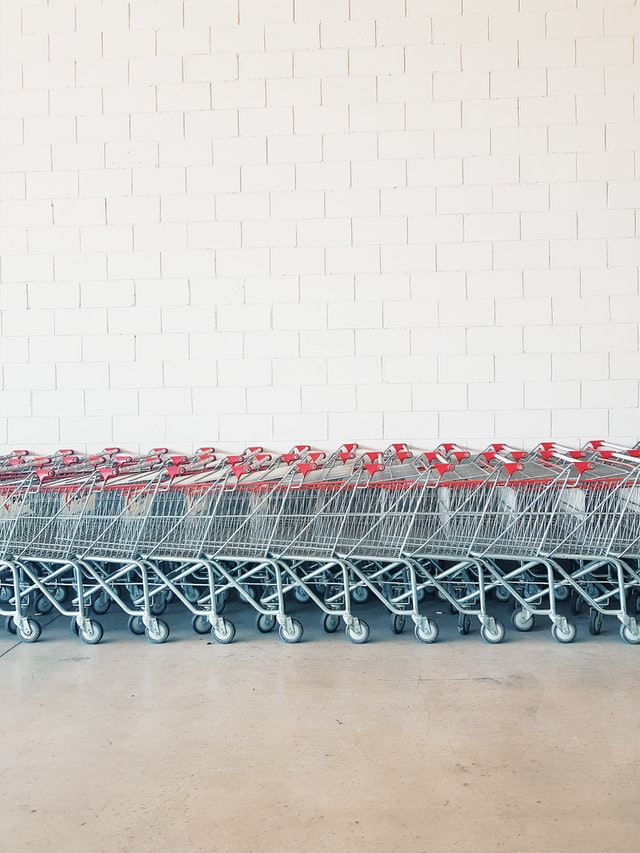
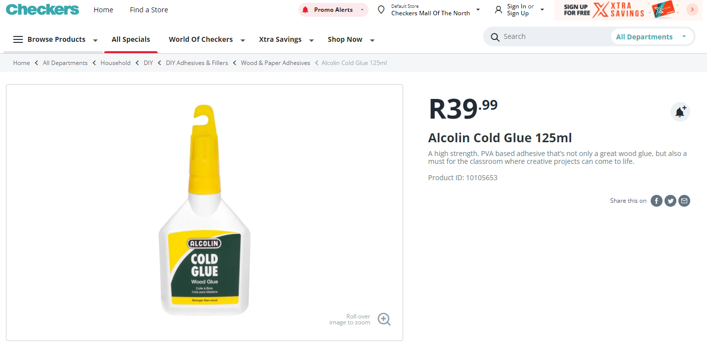
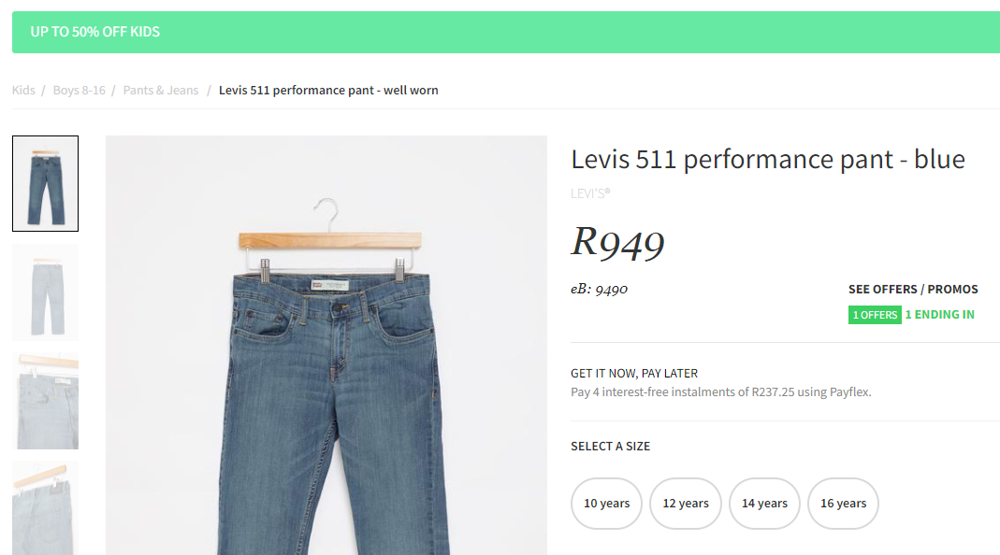
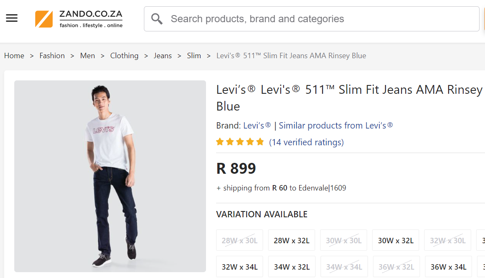
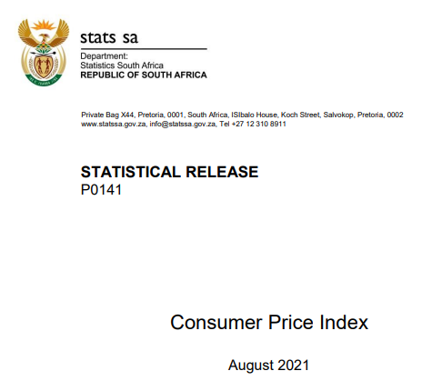

```{r, echo=F, message=F, warning=F}
# options(htmltools.dir.version = FALSE)
library(knitr)
opts_chunk$set(
  fig.align="center",  
  fig.height=4, 
  # dev = "svg",
  #fig.width=6,
  # out.width="748px", #out.length="520.75px",
  # dpi=300, #fig.path='Figs/',
  cache=T, echo=F, warning=F, message=F
)
library(hrbrthemes)
library(fontawesome)
library(xaringan)
library(xaringanExtra)
library(tidyverse)
library(here)
library(xaringanthemer)
xaringanExtra::use_panelset()
```


```{r}
xaringanExtra::use_progress_bar(color = "#EB821D", location = "top", height = "5px")

```
.pull-left[

# Potential use cases

1. [Reports for manufacturers: own products](#ownproducts)

2. [Reports for manufacturers: competitors products](#compproducts)

3. [Price comparison app](#app)

4. [CCSA investigation aid](#ccsa)

5. [StatsSA inflation supplement](#statssa)


]

.pull-right[

```{r}

```

]
---

class: inverse, center, middle
name: ownproducts

# Reports for manufacturers: own products

Manufacturer surveillance on downstream retail pricing

<html><div style='float:left'></div><hr color='#EB811B' size=1px width=796px></html>

---
# Downstream retail pricing

.pull-left[
Provide evidence on effective price of a manufacturers *own* product.

* Alcolin and Checkers agree to work together
* Checkers says we will sell it at retail price of R39.99 and special of R29.99 during 'back to school' for two weeks.
* Alcolin agrees with Checkers on unit price of R20
* `trundler` shows that Checkers only had special on for one week
* Alcolin can bargain for higher unit price. 
]

.pull-right[

```{r, fig.cap="Alcolin glue on Checkers website"}

```


]
---
class: inverse, center, middle
name: ownproducts

# Reports for manufacturers: competitors products

Manufacturer information on competitors retail pricing

<html><div style='float:left'></div><hr color='#EB811B' size=1px width=796px></html>

---

# Competitors retail pricing

Basic use case - check your competitors pricing and promotion patterns.

.pull-left[

```{r, fig.cap="Levis 511 jeans - Superbalist"}

```

]

.pull-right[

```{r, fig.cap="Levis 511 jeans - Zando"}

```
]

---
class: inverse, center, middle
name: app

# Price comparison app

<html><div style='float:left'></div><hr color='#EB811B' size=1px width=796px></html>


---

# Best grocery deals

.pull-left[

Like [pricecheck](https://www.pricecheck.co.za/), but better?

* My granny would use it - she's very price sensitive!

* Pricecheck looks like trash now, why?

* Pushback from supermarkets?

]

.pull-right[

```{r}
knitr::include_graphics("images/app-image.jpg")
```


]


---

class: inverse, center, middle
name: ccsa

# Competition authority investigation aid

<html><div style='float:left'></div><hr color='#EB811B' size=1px width=796px></html>


---

# CCSA investigation aid

.pull-left[

Aid during CCSA investigations.

* CCSA asks parties involved to provide their own data during discovery

* Third parties are asked by CCSA to cooperate - they can refuse if it is going to be too difficult.

* Even when third parties do provide information - it's all jumbled and hard to compare!

* `trundler` could be the tool to use! Comparable and detailed historical pricing data would be ideal.

]

.pull-right[

```{r}

```


]

---

class: inverse, center, middle
name: statssa

# StatsSA inflation supplement

<html><div style='float:left'></div><hr color='#EB811B' size=1px width=796px></html>


---

# StatsSA inflation supplement

.pull-left[

### Addition to StatsSA's P0141 - Consumer Price Index (CPI)???

Stats SA has got some problems - maybe these indexed pricing reports as a service could be useful to them?

]

.pull-right[

```{r}

```

]
---

# My questions

* Competition concerns

* Frequency

* Fragility
